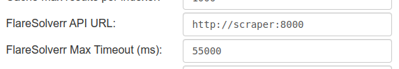

# simple-cloudflare-solver

**simple-cloudflare-solver** est une API permettant de contourner le système de protection de Cloudflare. Elle peut être utilisée comme une passerelle par des applications comme Jackett et Prowlarr pour accéder aux ressources protégées.

## Fonctionnalités

- Bypass du solver Cloudflare pour un accès automatisé aux sites protégés.
- Utilisation en tant que passerelle pour des services tiers comme Jackett et Prowlarr.
- Lancement de l'API en local ou via une image Docker.

## Installation

### Prérequis

- Python 3.12+
- PDM (Python Dependency Manager) pour la gestion des dépendances

### Installation des dépendances

```bash
curl -sSL https://pdm-project.org/install-pdm.py | python3 -
pdm install --check --prod --no-editable
```

## Usage

### Lancer l'API en local avec Python

Pour exécuter l'API localement, lancez simplement le script principal après avoir installé les dépendances :

```bash
pdm run python src/server.py
```

### Utiliser Docker

Une image Docker est générée via la CI de GitHub, permettant de lancer l'API de manière simplifiée sans gérer manuellement les dépendances. Pour utiliser cette image, exécutez la commande suivante :

```bash
docker pull ghcr.io/nlevee/simple-cloudflare-solver:main
docker run --rm -p 8000:8000 ghcr.io/nlevee/simple-cloudflare-solver:main
```

L'API sera alors accessible sur <http://localhost:8000>.

### Utiliser Docker Compose

Un exemple de [docker-compose.yaml](docker-compose.yml) est disponible pour tester avec Jackett:

```bash
docker compose up -d --build
```

L'API sera alors accessible sur <http://localhost:8000> et Jackett sur <http://localhost:9117>.

## Configuration du port

Le port d'écoute de l'API peut être changer via un paramètre de démarrage. Par exemple :

```bash
docker run --rm -p 8080:8080 ghcr.io/nlevee/simple-cloudflare-solver:main --port 8080
```

L'API sera alors accessible sur <http://localhost:8080>.

## Intégration avec Jackett et Prowlarr

Jackett : Configurez Jackett pour utiliser l'API en tant que *FlareSolverr API* pour les sites protégés:



Prowlarr : Ajouter l'API en tant que Proxy d'indexer (cf. <https://trash-guides.info/Prowlarr/prowlarr-setup-flaresolverr/>).

## Contribution

Les contributions sont les bienvenues ! N'hésitez pas à soumettre une pull request ou à ouvrir une issue pour toute suggestion d'amélioration.
